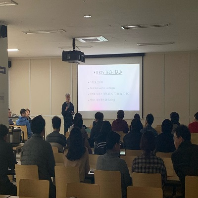

이투스교육 첫번째 기술 세미나인  '**ETOOS Tech Talk**'을 진행하였습니다. Tech Talk은 분기별 1회 진행하는데 이번 세미나는 1월 29일 이투스교육 서초사옥 B1층에서 열렸습니다.

**ETOOS Tech Talk**은 이투스교육의 기술브랜드 가치를 높이기 위해 DX혁신부문 Tech Lab에서 업무 및 과제 수행 중 습득한 기술 지식, 경험, 성과 등을 사내외에서 공유하는 세미나입니다. 개발자들이 어떤 업무를 진행하고 있고, 많은 서비스를 관리하면서 어떻게 발전시키고 또한 어떤 문제들을 헤쳐나가야 하는지에 대해 소통할 수 있는 시간입니다. 

처음으로 열린 이투스교육 기술세미나 였음에도 불구하고, 다양한 사업부서에서 참석하였습니다. Tech Lab 소속이 아닌 직원들은 전문지식이 없어도 쉽게 이해할 수 있도록 진행하였습니다. 업무 관련 궁금한 사항에 대해 질의응답 시간도 갖고, 앞으로의 방향에 관해서도 이야기하는 뜻 깊은 자리가 되었습니다!

이번 **발표주제**는 세가지 Session을 선정하여 진행하였습니다. 

|  Session  |                      주제                      |   발표자    |
| :-------: | :--------------------------------------------: | :---------: |
| Session 1 |         AWS Re:Invent Las Vegas 참관기         | 남희성 과장 |
| Session 2 | 19년도 배치표 서비스 개편 AS-IS, TO-BE & TO-DO | 이지환 차장 |
| Session 3 |        서비스 성능개선 사례 (DB Tuning)        | 김도영 팀장 |

**Session 1.  AWS Re:Invent Las Vegas 참관기**

첫 번째 세션은 남희성 과장님이 Las Vegas에서 진행된 AWS에서 주최하는 세계 최대의 클라우드 컴퓨팅 컨퍼런스인 **AWS Re:Invent** 행사에 다녀온 후기를 공유하였습니다.

어마어마한 행사 규모, 참석 인원, 발표한 서비스의 수를 보고 놀라움을 감출 수 없었습니다. 행사에 직접 참가하진 않았지만 재치 있는 말솜씨와 함께 사진으로 생생한 후기를 들려주셔서 즐겁게 경청할 수 있었습니다. (아래 링크로 이동하면 사진을 볼 수 있습니다)

개발자로서 기회가 주어진다면 꼭 참가하고 싶다는 마음이 들 정도로 흥미 있는 발표였습니다!👍

발표자료 - [AWS re:invent](/blog/aws_reInvent)

**2. 19년도 배치표 서비스 개편 AS-IS, TO-BE & TO-DO**

두 번째 세션은 이지환 차장님이 배치표 이전 서비스의 문제점과 2019년도에 개선된 점, 앞으로의 목표를 공유하였습니다.

**배치표**는 정시 합격 예측 서비스로, 성적을 입력하면 분석하여 합격 가능성을 진단해주고, 대학을 추천해주는 서비스입니다. 이 서비스의 진행되는 과정과 그 과정에서 발생하는 문제점에 대해 구체적인 설명을 해주셔서 명확하게 파악할 수 있었습니다.

목표를 달성하기 위해 노력하는 개발자의 모습이 무척 멋있습니다!👍

발표 자료 - [20년도 배치표 서비스 개편 AS-IS, TO-BE & TO-DO](/blog/etoos_arrangement/)

**3. 서비스 성능개선 사례 (DB Tuning)/선도개발팀 김도영 팀장**

세 번째 발표는 김도영 팀장님이 AWS로의 서비스 전환 스토리와 SQL 튜닝 작업을 통해 얻은 장점을 공유하였습니다.

클라우드로 데이터베이스를 이전하여 얻게 된 비용 절감, 업무 변화 등을 그래프와 수치로 정리하여 한눈에 이해할 수 있었습니다. 이런 성능 개선 사례로 SQL 튜닝 작업을 설명하였는데 이를 통해 방대한 양의 데이터를 보다 빠르고 개선된 속도로 출력할 수 있다는 내용이 굉장히 흥미로웠습니다!😄

<!-- 발표 자료 - [서비스 성능 개선 사례(DB Tuning)](/blog/slowQuery_Tunning) -->

30분씩 발표를 진행한 후, 간단한 **Q&A** 시간을 가졌습니다. 질문 하나하나에 정성껏 답변해주셔서 현장에서 바로 궁금증을 해결할 수 있었습니다.

이번 Tech Talk 세가지 세션에는 개발자로서 성장과 기술적인 내용이 담겨있어 얻어갈 내용들이 많았습니다. 발표하신 남희성 과장님, 이지환 차장님, 김도영 팀장님 유용한 정보를 공유해 주셔서 감사합니다.

## **이벤트**

입장할 때 번호표를 나눠드린 후, 추첨을 통해 5분께 선물을 드리는 이벤트를 진행하였습니다. 개발자 행사인 만큼 다음에는 추첨 프로그램을 직접 개발해서 진행하면 좋을 것 같다는 생각을 하였습니다. 

이벤트 당첨자분들께서 이번 **Tech Talk 행사 후기**를 들려주셨습니다.

|      팀 명       |    이름     |                             후기                             |
| :--------------: | :---------: | :----------------------------------------------------------: |
|  서비스기획1팀   | 정홍민 과장 | 준비하신 발표 내용을 들으면서 Tech Lab에서 서비스의 질을 향상시키기 위해 많은 고민과 노력을 하고 있다는 것을 알 수 있었습니다. |
|  서비스기획2팀   | 나지연 사원 | 개발자가 아닌 사람도 이해하기 쉽게 설명해주신 강사님들 덕분에 유익한 내용들을 배우고 얻어갈 수 있었습니다. |
|     웹개발팀     | 방민주 사원 | 기술 세미나이지만 전문지식이 없어도 이해할 수 있는 내용이라 좋았습니다. 앞으로 이런 세미나가 주기적으로 다양한 주제로 했으면 좋겠습니다. |
| 학원솔루션개발팀 | 정범준 대리 | 앞으로도 계속 이어져 나갔으면 하는 행사이고 언젠가는 저도 행사장에서 기술적으로 발표할 수 있는 개발자가 됐으면 좋겠다고 생각했습니다. |
|    사업전략팀    | 이주호 사원 | 평소 궁금했던 AWS 이관, DB 성능개선 등에 대해 접할 수 있어서 좋았고, 더불어 경품까지 득하게 된 좋은 자리였습니다. |

당첨되신 분들 다시 한 번 축하드립니다!👍

## **마치며**

처음이라 서툰 부분도 많았지만 발표 내용이 유익하고, 이해하기 쉬웠다는 후기들을 들을 수 있었습니다. 이번 Tech Talk을 시작으로 더 알차고, 다양한 주제로 준비하여 앞으로 사내직원들과 함께 공유하며 소통하는 자리를 주기적으로 마련해야 겠다고 생각했습니다.

다음 **Tech Talk**은 또 다른 주제로 찾아뵙겠습니다.

자리를 빛내주신 참석자 분들과 세션을 발표한 세분께도 유익한 시간이 되었기를 바랍니다.

![img7]