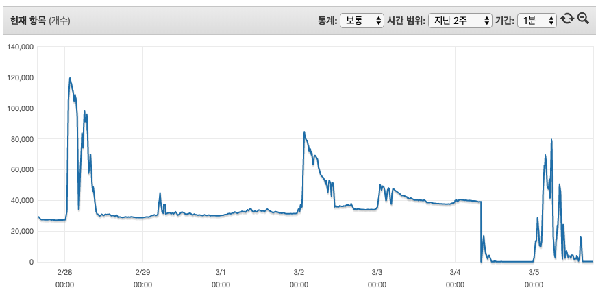
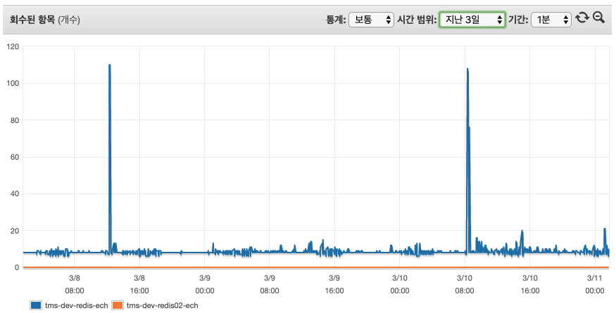
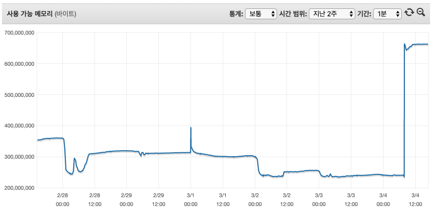
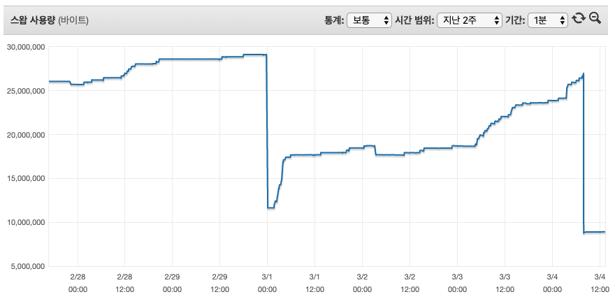

AWS 레디스를 사용하고 있는데 뜬금없이 OOM이 발생했다고 알림을 받았고 당황한 적이 있습니다. 
보통은 TTL을 설정해서 해결을 하고 있긴 한데 사용량 측정을 잘못했나? 할정도로 용량이 꽉차서 급하게 Flushall 을 했네요. 
그래서 궁금증을 못참고 레디스에 대한 스트레스 테스트를 하기로 마음을 먹었습니다. 

> 안녕하세요. DX혁신부문 학원솔루션개발팀에 이병철입니다. :)  
> AWS Elastic Cache를 이용하고 있는 도중에 OOM이 발생하는 사건을 계기로 Redis를 좀더 분석해볼필요가 있다라고 판단했습니다.  
> 많은걸 분석할시간이 부족하여 부하테스트 위주로 작업을 진행했습니다. 

## 개요

- Redis Error OOM(Out of memory) 발생
- Session key 저장하면서 TTL 설정이 일부 안된걸로 파악

### 장애 







|            | 3월4일 (장애시점) | 2월28일 (최대치) | 비고 |
| :--------- | :---------------: | :--------------: | :--: |
| 잔여메모리 |       239M        |       243M       |      |
| 사용개수   |      39,152       |     119,500      |      |
| 캐시사용   |       436M        |       436M       |      |

```
* 어플리케이션 로그에 OOM으로 나와서 메모리 사용량을 봐도 3월4일에 239M 여유가 있음. (비교, 2월28일에 최대사용갯수 기준으로 243M 여유)
* 레디스 키발행과 회수에 관한 로직 문제점이 없어 보임. 
* 과도한 스왑사용으로 인한 오류라고 보기엔 스왑범위가 너무 작음 (23M)
```

> - 메모리가 여유가 있는데 왜 시스템이 멈출까?  
> - 2월28일에 최대로 사용했는데 그때는 문제가 왜 없었지?   
>
> 위에 두가지 궁금증이 발생했습니다. 그래서 AWS Tam 에게 도움을 요청했고 다음과 같은 답변을 받았습니다. 

## AWS Q&A

```
1차 문의  
Q : 메모리 여유가 있는데 왜 시스템이 멈췄을까요?
A : 581M 메모리중에 예약메모리 25%를 제외한 436M까지 사용이 가능합니다.  
예약메모리의 경우 새로운 키를 작성하는데 사용하는데 한계에 도달할 경우 예전에 만들어 놓은 키를 제거하거나 TTL이 없는 키를 제거합니다.  
다만 위 전제조건에 일치하는 키가 없을경우 OOM 오류를 반환합니다. 
```

```
2차 문의  
Q : CloudWatch 에서 특정인계치에 도달했을경우 Lambda를 이용해서 Flush 하는건 괜찮을까?
A : 권장하지 않음. 모니터링 지표로 보아 T3.medium 권장, MaxMemory-policy 를 검토하여 수치를 조절할것

Q : HA(replica) 구성을 했을경우 Master node에 OOM이 발생했을 경우 Slave node 가 Master node로 승격되어 이행할수 있을까?
A : replica 구조에서 Slave node (승격후)에 쓰기시도시 OOM 발생할수 있음.
```

### AWS 제안

- Max Memory-policy 정책변경 (volatile-lfu -> allkeys-random)  

|      옵션       | 설명                                                         | 비고 |
| :-------------: | :----------------------------------------------------------- | :--: |
|  volatile-lfu   | 가장 적게 액세스한 키부터 시작해 만료가 <br> 설정된 키 하나를 제거하여 공간 확보 | 기본 |
|   allkeys-lru   | 최근 사용한 키를 먼저 제거하여 공간 확보                     |      |
| allkeys-random  | 무작위로 키를 제거하여 공간 확보                             | 권장 |
| volatile-random | 만료가 설정된 무작위 키를 제거하여 공간 확보                 | 권장 |
|   allkeys-lfu   | 가장 적게 액세스한 키를 제거하여 공간 확보                   |      |

- 예약 메모리 비율 (reserved-memory-percent) 조정(단, 단독구성시 필요없음)
- 데이터 수명주기 정책 (TTL이 만료되어 학제되는 속도 < 데이터쓰기속도 = OOM발생 )

> 이런 설정이 있었는지 처음에 몰라서 문의사항 및 제안 방식에 따라서 써보려고 했습니다.  
> 근데 진짜 저렇게 했을때 이슈가 없을까? 라는 의구심이 들기 시작했죠. 
> 그래서 테스트계획을 하고 테스트 진행을 하기로 했습니다. 

## Test

#### 테스트설정

| 구성 |   사양    | 복제여부 | 예약메모리 |           삭제설정            |    메모리     | 테스트코드 |
| :--: | :-------: | :------: | :--------: | :---------------------------: | :-----------: | :--------: |
| 단독 | t2.micro  |    N     |    25%     | TTL 설정된값만 삭제(기본설정) |    668.5MB    | RED_TST_01 |
| 단독 | t2.micro  |    N     |     0%     | TTL 설정된값만 삭제(기본설정) |    699.0MB    | RED_TST_02 |
| 단독 | t2.micro  |    N     |     0%     |           랜덤삭제            |    699.0MB    | RED_TST_03 |
| 복제 | t2.micro  |    Y     |     0%     |           랜덤삭제            | 699.0MB/635MB | RED_TST_04 |
| 단독 | t2.medium |    N     |    25%     | TTL 설정된값만 삭제(기본설정) |   3,174.4MB   | RED_TST_05 |
| 단독 | t2.medium |    N     |     0%     |           랜덤삭제            |   3,557.5MB   | RED_TST_05 |

#### RED_TST_01 ( t2.micro / 25% / volatile-lfu )

|          |  발행개수 |  누적개수 | 시간(sec) | 캐시사용 메모리(MB) | 스왑(MB) | 잔여 메모리(MB) | 초당 발행개수 | 비고                                                     |
| :------: | --------: | --------: | --------: | ------------------: | -------: | --------------: | ------------: | :------------------------------------------------------- |
|  발행전  |         0 |         0 |         0 |                   0 |        0 |           668.5 |             0 | 272Byte/Key                                              |
| 신규발행 |   200,000 |   200,000 |       259 |                  83 |        0 |           583.6 |           772 |                                                          |
| 신규발행 | 1,000,000 | 1,000,000 |     1,245 |                 387 |     40.6 |             279 |           803 |                                                          |
| 추가발행 | 1,000,000 | 1,060,498 |        78 |               416.2 |     54.3 |           250.7 |           775 | OOM 발생 <br> (volatile-lfu 설정,<br>TTL이 설정안된상태) |

#### RED_TST_02 ( t2.micro / 0% / volatile-lfu )

|          |  발행개수 |  누적개수 | 시간(sec) | 캐시사용 메모리(MB) | 스왑(MB) | 잔여 메모리(MB) | 초당 발행개수 | 비고                                                   |
| :------: | --------: | --------: | --------: | ------------------: | -------: | --------------: | ------------: | :----------------------------------------------------- |
|  발행전  |         0 |         0 |         0 |                   0 |        0 |           699.0 |             0 | 272Byte/Key                                            |
| 신규발행 | 1,800,000 | 1,434,287 |       410 |                 581 |     82.9 |             110 |         3,414 | 6 Thread<br>300,000개 등록                             |
| 추가발행 |   300,000 | 1,434,986 |         1 |                 581 |     95.2 |             110 |           699 | OOM 발생<br>(volatile-lfu 설정,<br>TTL이 설정안된상태) |

#### RED_TST_03 ( t2.micro / 0% / allkey-random )

|          |  발행개수 |  누적개수 | 시간(sec) | 캐시사용 메모리(MB) | 스왑(MB) | 잔여 메모리(MB) | 초당 발행개수 | 비고                                         |
| :------: | --------: | --------: | --------: | ------------------: | -------: | --------------: | ------------: | :------------------------------------------- |
| 추가발행 | 1,500,000 | 1,432,361 |       390 |                 581 |      123 |             132 |          3672 | OOM 발생안함<br>(랜덤키삭제로 인한 손실우려) |

#### RED_TST_04 ( t2.micro / replica / 0% / allkey-random )

|          |  발행개수 |  누적개수 | 시간(sec) | 캐시사용 메모리(MB) | 스왑(MB) | 잔여 메모리(MB) | 초당 발행개수 | 비고 |
| :------: | --------: | --------: | --------: | ------------------: | -------: | --------------: | ------------: | :--- |
| 신규발행 | 1,500,000 | 1,429,286 |     1,860 |               554.8 |     28.9 |           121.5 |         554.8 |      |
| 추가발행 |   500,000 | 1,429,078 |       638 |               554.8 |     29.2 |           121.5 |           783 |      |

#### RED_TST_05 ( t2.medium )

|          |  발행개수 |  누적개수 | 시간(sec) | 캐시사용 메모리(MB) | 스왑(MB) | 잔여 메모리(MB) | 초당 발행개수 | 비고                                           |
| :------: | --------: | --------: | --------: | ------------------: | -------: | --------------: | ------------: | :--------------------------------------------- |
| 신규발행 | 9,000,000 | 6,438,368 |     1,759 |             2,475.7 |        0 |         1,076.4 |         3,660 | 예약메모리 25%<br>, volatile-lfu,<br>3174.4MB  |
| 신규발행 | 9,000,000 | 8,438,657 |     1,560 |             3,286.3 |      3.4 |           233.5 |         5,409 | 예약메모리 0%,<br>allkeys-random,<br>3,557.5MB |

위 테스트를 해본결과 다음과 같이 요약해 보았습니다. 

```
부하테스트 결과

- 시스템에 맞는 인스턴스 사양(t2.micro 140만, t2.medium 843만)
- Replica 구성시 Write / Read 분리정책 필요
- Max Memory-policy 정책에 의한 데이터 삭제시 장애없는 시스템 구축(allkeys-random 추천)
- eksehrrntjddlftl dPdirapahfl 0%
```

## 마치며

> 온프레미스 환경에서 레디스 설치시 서버의 성능을 받아서 처리되지만 AWS상에서 설정을 좀 다르다는걸 확인했습니다.     
> 보통 설명서를 잘 안읽어 보고 접근해서 적용했었는데 앞으로 설명서를 잘읽어야 겠다는 반성도 했고요.    
> 테스트를 하면서 불필요하다라고 생각하지 않았지만 원하는 결과가 도출이 안되었을때 후회를 좀 했었는데 이번테스트로 결과물을 얻고 정보공유를 할수 있어서 좋았습니다.  
> 많이 부족한 글을 읽어 주셔서 감사합니다.  

## Reference

- 예약 메모리 비율(reserved-memory-percent )  
  ElastiCache(Redis) 클러스터에서 FailOver 발생 시 Master 노드의 메모리 덤프가 발생,  
  Redis는 메모리 덤프 시 메모리 공간 전체에 대해 locking 후 디스크에 기록하는 과정을 거치는데  
  ElastiCache에서는 할당된 예약 메모리 공간을 활용하여 요청되는 쓰기 작업들을 기록한다.   
  이때 요청되는 쓰기 수 보다 예약 메모리 공간이 적으면 해당 프로세스는 모두 실패가 되기 때문에
  서비스의 고가용성을 고려하여 예약메모리 사용비율을 적절하게 조정할 필요가 있다.  
  클러스터 구성이 아닌 상황에는 예약메모리가 사용될 경우가 없기 때문에 파라미터 그룹 옵션에서 예약메모리를 제거하는 것을 고려할 필요가 있다.

- https://docs.aws.amazon.com/ko_kr/AmazonElastiCache/latest/red-ug/Replication.Redis.Groups.html
- https://docs.aws.amazon.com/ko_kr/AmazonElastiCache/latest/red-ug/Replication.Redis-RedisCluster.html
- https://aws.amazon.com/ko/premiumsupport/knowledge-center/oom-command-not-allowed-redis/
- https://docs.aws.amazon.com/ko_kr/AmazonElastiCache/latest/red-ug/scaling-redis-cluster-mode-enabled.html
- https://docs.aws.amazon.com/ko_kr/AmazonElastiCache/latest/red-ug/Strategies.html

```
!Warning : 작성자가 직접 ETOOS TechBlog에 작성한 게시물 내용입니다. 
           게시물의 저작권은 ETOOS에 있습니다.
```