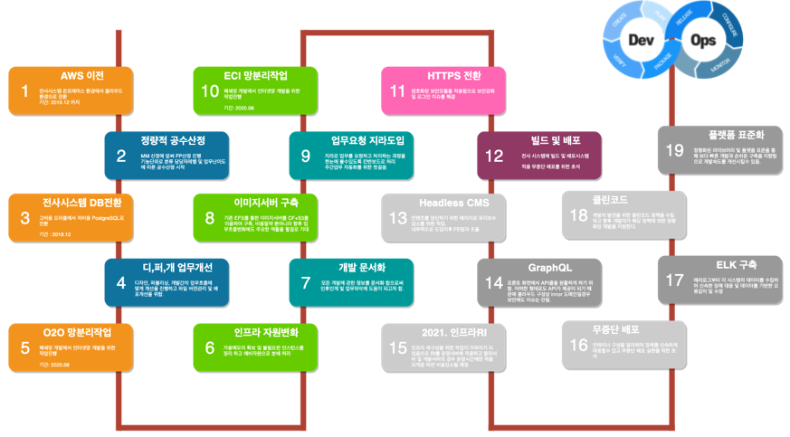
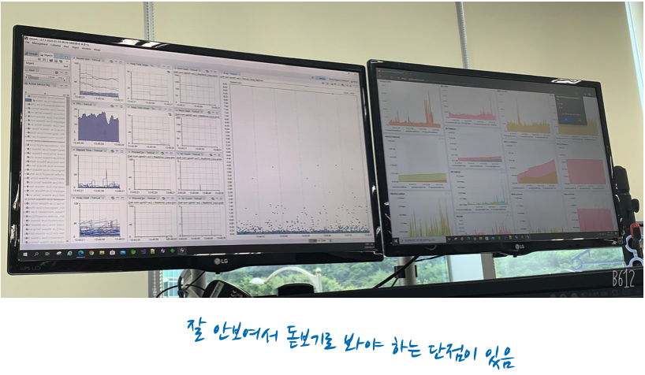
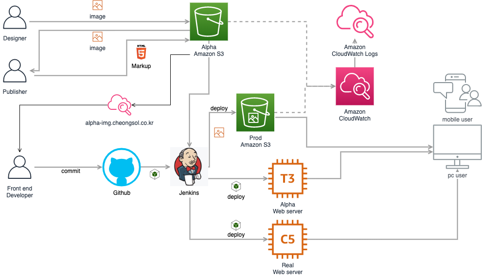
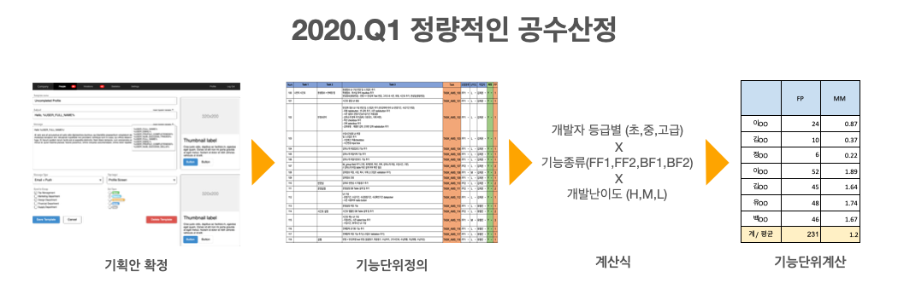
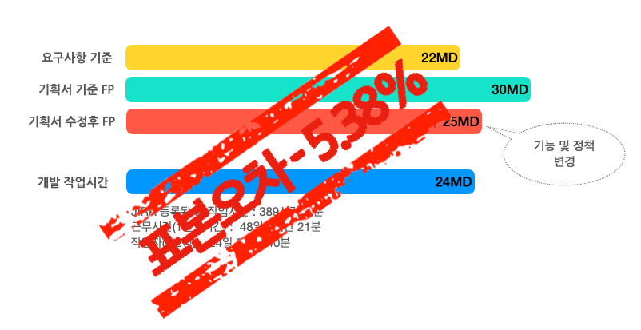

입사초기 낙후된 시스템과 협업이 잘안되는 이슈로 크고 작은 사고가 많이 발생했고 지금도 많이 개선이 되었다고 생각했는데
아직 갈길이 많이 멀구나 라는 생각이 드네요. 지난 1년동안 팀내에 얼마나 많은 변화가 있었고 그로인한 업무효율이 좋아졌는지를 보여드리고자 합니다. 

> 안녕하세요. DX혁신부문 학원솔루션개발팀에 이병철입니다. :) 
> 이번엔 우리팀의 나아가야할 방향(데브옵스)으로 잘 나아가고 있는지 보여드리고자 합니다. 
> 거창하게 말하면 데브옵스지만 소소하게 부족한 부분을 채우고 좀더 발전적인 팀이 되고자 노력했던 부분을 보여드리는 자리가 될듯 합니다. 

작년 처음왔을때 팀내엔 빌드,배포시스템도 없고 모니터링도 없으며 오래된 개발 Framework도 문제였지만 기획자간의 협업도 이슈가 많아 보였습니다.  

> "와~ 이걸어떻게 하지?"  

라는 생각이 먼저 들더군요.  
프로젝트와 유지보수에 모든 개발자들이 집중을 하고 기획간의 협업은 전화나 메신저로 하며 대면회의는 거의 찾아볼수가 없었습니다.  
신입직원들이 입사를 하고 "이 프레임워크 해봤니?" 라고 하면 그게 어떤건지 아는데 오래되어서 알방법도 없고 일수 있는 방법을 찾기란 너무 힘들었죠.  
입사하고 OJT가 있는게 아니라서 오자마자 "당신담당은 이것입니다." 라고 말할때 직원들의 표정은 맨붕 그 자체였죠.    
인수인계가 가장 큰 문제였는데 퇴직자는 퇴사일 전에 인수인계문서를 만드느라 정신이 없고 문서자체를 보면 도저히 알아보기 힘들정도였습니다.
이걸 보고 개발하기란 어려웠죠. 그래서 아예 안보거나 새롭게 경험을 쌓기 시작한거죠. 이런 불필요한 인수인계문서 빨리 개선을 해야할 필요성을 절실하게 느꼈습니다.  
비단, 저희 뿐만 아니라 다른회사도 마찬가지이지 않을까요? 

그래서 개발자들이 데브옵스를 향해 나아가고 있긴 합니다. 간단하게 설명드리자면 일반적인 IT회사에서 개발자는 개발만 하고 운영자는 운영만 하는 팀들로 구성된 곳이 많은데  
devops는 개발자가 개발,테스트,운영까지 모두다 하는걸 의미 합니다. 너무 간단하죠?  

### 데브옵스 특징

* 하나의 팀에서 개발부터 운영까지 해야 한다.
* 하나의 지표가 필요하다.
* 반복적인 업무는 자동화 한다.
* 장애와 이슈는 서로 공유해야 한다.
* 짧은주기의 배포를 통한 기능개선 및 Voc 반영을 해야 한다.

## 전지적 데브옵스 시점 

> 저희 팀이 가려면 개선할 사항이 많구나~!! 라고 깨닫고 몇가지 개선점을 찾아서 진행하였습니다.  
> 인프라적인 개선이 먼저 이뤄졌지만 개발, 업무에서도 차차 진행하고 있습니다. 

### 인프라 개선

#### AWS 전환

온프레미스 환경에서 AWS전환을 2019년말에 했습니다.  
기존시스템을 그대로 옴겨서 그런지 인스턴스 사이즈도 크고 정확한 용량측정이 안되어서 비용이 많이 나왔었습니다. 
하지만 Oraclde에서 PostgreSql로 전환한 시점에 비용이 대폭 축소하게 되었습니다. 라이센스 비용이 빠졌죠.

#### 불필요한 자원축소

클라우드 전환할때 IDC시스템을 그대로 옴기다 보니 이전에 사용하던 환경까지 모두 가지고 오게 되었습니다.   
물론 기존엔 그게 잘못된지 모르고 생성을 했던 시점인지라 클라우드로 변경하고 나서 환경세팅 및 설정을 다시 정비하게 되었고 
15% 자원을 축소할수 있었습니다.  
대부분 웹서버인데 기존에 WAS와 WEB이 1:1로 구성되다 보니 자원낭비가 심했고 정리이후 예비자원을 확보할수가 있었습니다.   

#### 서버 메모리 확보

서버마다 메모리를 한정적으로 사용하고 있는데 어플리케이션 메모리 설정이 예상보다 높아보여서 실측을 하기로 했습니다.  
스카우터를 이용해서 일주일단위로 메모리사용현황을 측정하였고 2달치의 동계를 통해 전체 80%정도 수정을 할수 있을듯 했습니다.  
예를들면 특정 어플리케이션에서 실제 최대 메모리 2.5기가인데 설정된 메모리값이 2~4기가로 되어 있어서 평균기준으로 메모리 조정을 하게 되었습니다.   
이렇게 수정이 되면 설정메모리 40%여유를 확보할수 있을듯 하네요.  

#### 개발서버 비용절약

클라우드로 전환하기 이전에 개발서버는 24시간동안 이용을 했었습니다.  
과연 개발서버를 24시간동안 사용을 했을까요? 개발자,기획자등 업무시간이외에 서버를 이용하고 있지 않았고 저흰 해당서버를 운영시간만 이용하려고 스케쥴 프로그램을 설치 해두었습니다.   
이렇게 되면 10대의 개발서버를 24시간동안 이용시 1500달러가 들었다면 12시간운영을 하면 751달러 근무일(20일)기준 12시간 운영을 하면 500달러정도 비용이 줄어드는걸로 확인했습니다.   
지난 8월에 해당 기능을 적용해서 현재는 월 66% 비용감소가 이뤄지고 있습니다.   

#### 모니터링 시스템 구축

이전엔 장애가 발생하면 유선 또는 메신저로 전달을 받아서 서버로그를 확인하곤 했습니다.   
지금은 모니터링시스템을 설치하여 팀원들이 수시로 볼수있게 가장 잘보이는 곳에 모니터 두대를 설치하여 매일 체크하고 있습니다.   
단점은 모니터가 작다보니 디테일한 정보는 확대를 해야 한다는 불편한점이 있네요.  

### 개발업무 개선

#### 개발프레임웍 변경 

입사초기에 스트럿츠프레임웍을 사용하고 있었는데 너무 오래되었고 해당 프레임웍으로 개발하는 개발자를 찾을수가 없었습니다.  
그래서 향후 개발하려는 프로젝트부터는 SpringFramework 으로 변경진행하였습니다.  
예전엔 한명의 개발자만이 해당 프로젝트를 수정이 가능했다면 현재 AMS의 경우 5명의 개발자가 수정이 가능할정도로 백업이 가능해졌습니다.  
이후에도 신규 및 전환프로젝트마다 프레임웍변환으로 팀내 전직원이 담당자가 없어도 처리가 가능하게 되었습니다.  

#### 빌드 및 배포 도입

아직도 존재하고 있지만 예전프로젝트에서 프로그램 개발이 완료가 되면 FTP를 통해서 배포하는 불편함이 있었습니다.   
FTP를 이용할경우 실수로 핵심파일을 배포하지 않거나 다른곳에 배포하는 실수를 범하게 되죠.  
그래서 배포시스템을 도입하기로 하였고 50%정도 배포시스템에 의해 배포가 이뤄지고 있습니다.  
서버배포시간을 몇시간에서 몇초로 단축시키는 효과를 봤습니다.  
향후 무중단배포시스템을 구축하여 하루에 1000번도 넘는 배포를 하고자하는게 저희팀 목표입니다.  

#### 디자인, 퍼블, FE 업무흐름 개선

디자인과 퍼블과의 협업이 원활하다고 해야 하는건지 모르겠지만 기존방식에서 새롭게 방식을 전환할 필요가 있었습니다.  
예를들면 기획자는 단순하게 텍스트 수정 및 이미지 변경건의 경우 개발팀에 문의를 하다 보니 프로그램엔 반영이 되었지만,   
정작 퍼블측엔 반영이 안되는 이슈가 생기게 되었고 단순 CSS 또한 개발자가 수정을 하다보니 퍼블에서 개발로 반영할때   
이전에 적용한 부분이 다시 문제가 되는 이슈가 발생했습니다.  
이러한 부분을 소스를 통일화 하고 배포 시스템을 개선할 필요가 있다고 판단해서 현재 개선진행중에 있습니다. 

### 업무개선

#### 정량적인 공수산정

첫번째로 올초에 도입한 개발공수산정방식을 좀더 정량화 하였습니다.  
개발자와 일하시는 분들은 모두 공감하실것 같은데 뭔가 필요에 의해 개발을 요청하게 되면 왜 이렇게 오래걸리지? 이 일정이 맞는건가? 라는 궁금증을 가지시는 분들도 계실거라고 생각합니다.  
기존에 공수산정이 개발자의 연차와 의견이 100%반영되었고 주니어개발자보다 시니어개발자들이 주로 공수산정 피드백을 많이 주었습니다.  
그렇다 보니 실 작업자가 주니어라면 해당 일정안에 처리하기 힘들었을뿐 아니라 일정지연 이슈도 발생 했습니다.  
그래서 누구나 할수 있는 정량적인 방법으로 산정을 진행하였습니다.  
개발담당자들이 직접 본인이 해야할 부분을 기능단위로 분류하고 개발자등급과 기능종류 및 개발난이도에 따라 점수를 부여하는 방식으로 좀더 정확한 산정을 하게 되었습니다.  

최근에 작업한 수학일일테스트를 샘플로 보여드리겠습니다.  
요구사항기준으로 처음 22MD고 기획안내용을 보고 재산정해 보니 30MD가 나왔습니다.  
기획안 내용을 토대로 FP산정을 하였고 기획안 수정 및 정책변경으로 인해 25MD가 나왔네요.   
개발완료 이후 순수하게 개발했던 일정을 보니 총 389시간(지라 작업로그의 합) 작업을하였고 개발자 1인당 24일 2시간 40분을 근무했습니다.  
오차범위는 -5%정도로 빠른 개발을 했는데 저희는 이 오차범위도 최소화 하려고 기능세분화 작업을 진행하고 있습니다.

#### 협업도구를 통한 업무효율화

직장인의 이직을 하는 이유중에 하나는 불필요한 업무 및 과한 업무분량이라고 생각합니다.  
불필요한 업무는 아니지만 꼭 해야 하나? 라고 생각되는게 일일보고 주,월간보고 입니다.  
올초에 지라를 도입하고 데이터가 축적되면서 보고서를 쓰지 않게 되었습니다.  
개발자는 소스개발이 완료가 되면 깃허브에 소스를 커밋할때 다음과 같은 메세지를 추가해 주면 지라가 해당 메세지를 인식해서 작업시간 및 커멘트를 등록해 줍니다. 
컨플루언스 문서에 다음과 같이 주간현황 및 업무진척도가 자동적용이 되게 됩니다. 최근엔 주간보고는 제가 작성하고 팀원들에게 잘못된 부분이 있는지 확인을 받고 있습니다. 

#### 개발 문서화

다음으로 문서화 작업을 시작 했습니다. 지금까지 167건의 기술자료와 프로젝트 자료를 문서화 했으며 서로 공유가 필요한 사안에 대해서 모두 문서로 공유하도록 하고 있습니다.  
문서가 왜 필요하신지는 다들 아실겁니다. 문서화가 잘되어 있다면 인수인계가 수월하지 않았을까요? 퇴직전에 부랴부랴 문서작업을 했다면 누락없이 모두 들어 있을까요?  
담당자가 평소 업무에 대한 문서화가 되어 있다면 후임자가 그 문서를 토대로 업무를 하는데 아무런 문제가 없겠죠.  
다른요인도 있겠지만 문서를 토대로 업무적응시간도 단축이 될것이고 자연스럽게 업무순환도 무리없을듯 합니다.  
만약 장애발생시 담당자가 없다는 이유로 해결못한 사안이 발생했다면 앞으론 모든 개발자가 문제를 해결해 줄수 있지 않을까? 생각 됩니다.   

> 지난 1,2분기동안 데브옵스로 가기위해 저희 팀원들과 쉴새없이 달려왔습니다.   
> 물론 아직 보기엔 많이 부족하고 앞으로 해야할 부분이 많이 었어 보입니다.   
> 항상 노력해주는 팀원들에게 감사인사를 전하며 이상 마치겠습니다. 

~~~
!Warning : 작성자가 직접 ETOOS TechBlog에 작성한 게시물 내용입니다. 
           게시물의 저작권은 ETOOS에 있습니다.
~~~
